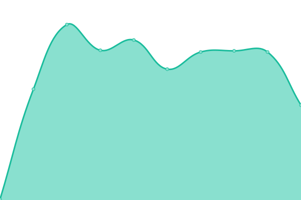

# [📈 Live Status](https://statius.shippersedge.com): <!--live status--> **🟩 All systems operational**

This repository contains the open-source uptime monitor and status page for [Upptime](https://upptime.js.org), powered by [Upptime](https://github.com/upptime/upptime).

With [Upptime](https://upptime.js.org), you can get your own unlimited and free uptime monitor and status page, powered entirely by a GitHub repository. We use [Issues](https://github.com/upptime/upptime/issues) as incident reports, [Actions](https://github.com/ShippersEdge/upptime/actions) as uptime monitors, and [Pages](https://statius.shippersedge.com) for the status page.

<!--start: status pages-->
<!-- This summary is generated by Upptime (https://github.com/upptime/upptime) -->
<!-- Do not edit this manually, your changes will be overwritten -->
<!-- prettier-ignore -->
| URL | Status | History | Response Time | Uptime |
| --- | ------ | ------- | ------------- | ------ |
|  [ShippersEdge TMS](https://app.shippersedge.com/health.cfm) | 🟩 Up | [shippers-edge-tms.yml](https://github.com/ShippersEdge/upptime/commits/HEAD/history/shippers-edge-tms.yml) | 

 1555ms
     
 | 

<a href="https://status.shippersedge.com/history/shippers-edge-tms">97.13%</a>
    

|  [ShippersEdge Carrier Portal](https://carriers.shippersedge.com) | 🟩 Up | [shippers-edge-carrier-portal.yml](https://github.com/ShippersEdge/upptime/commits/HEAD/history/shippers-edge-carrier-portal.yml) | 

 122ms
     
 | 

<a href="https://status.shippersedge.com/history/shippers-edge-carrier-portal">96.95%</a>
    

|  [ShippersEdge Supplier Portal](https://routing.shippersedge.com) | 🟩 Up | [shippers-edge-supplier-portal.yml](https://github.com/ShippersEdge/upptime/commits/HEAD/history/shippers-edge-supplier-portal.yml) | 

 169ms
     
 | 

<a href="https://status.shippersedge.com/history/shippers-edge-supplier-portal">96.88%</a>
    

|  [ShippersEdge Customer Portal](https://customers.shippersedge.com) | 🟩 Up | [shippers-edge-customer-portal.yml](https://github.com/ShippersEdge/upptime/commits/HEAD/history/shippers-edge-customer-portal.yml) | 

 133ms
     
 | 

<a href="https://status.shippersedge.com/history/shippers-edge-customer-portal">96.95%</a>
    

|  [ShippersEdge Dock Scheduler](https://schedule.shippersedge.com) | 🟩 Up | [shippers-edge-dock-scheduler.yml](https://github.com/ShippersEdge/upptime/commits/HEAD/history/shippers-edge-dock-scheduler.yml) | 

 132ms
     
 | 

<a href="https://status.shippersedge.com/history/shippers-edge-dock-scheduler">96.89%</a>
    

<!--end: status pages-->

[**Visit our status website →**](https://statius.shippersedge.com)

## 📄 License

- Powered by: [Upptime](https://github.com/upptime/upptime)
- Code: [MIT](./LICENSE) © [Upptime](https://upptime.js.org)
- Data in the `./history` directory: [Open Database License](https://opendatacommons.org/licenses/odbl/1-0/)
